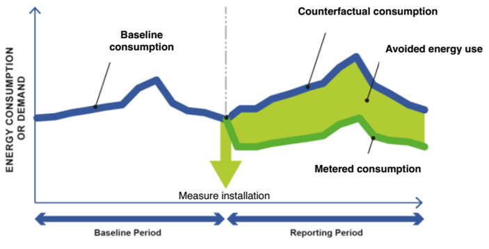

# The concept of measurement and verification of energy savings

Measurement and verification (M&V) of energy savings is fundamentally an impact assessment problem, where the goal is to estimate the counterfactual energy consumption – i.e. what would the energy consumption of a building have been had an energy efficiency intervention not occurred – using two sources of information: 

1. Occupancy-dependent information. Energy consumption reflects events and operations that take place inside the building and, as a result, recurrent events and routine operations lead to daily, weekly and yearly seasonality in the consumption that can be exploited (to the extent that the seasonality remains unaffected by the efficiency intervention). 

2. Occupancy-independent information that was predictive of the building’s energy consumption prior to the intervention. The most often utilized information is the outdoor air temperature.

The relationship for the quantification of the energy savings from a retrofit project is commonly defined as:

> energy savings = Counterfactual consumption based on baseline period data - Actual consumption during the reporting period $\pm$ Routine adjustments $\pm$ Non-routine adjustments

Some definitions:

**Baseline period**: The period of time prior to the intervention during which data is gathered so as to determine the relationship between energy consumption and the different independent variables that can predict it. 

**Reporting period**: The period of time following the intervention during which data is gathered so as to calculate energy savings (avoided energy use).

**Routine adjustments**: Routine adjustments account for any energy-governing  factors  expected  to  change  routinely  during  the  reporting  period, such as weather, operating hours or service levels (e.g. a new tenant requires different indoor conditions). The characterization “expected” means that the predictive model developed during the baseline period is able to adjust to such changes.

**Non-routine adjustments**: Non-routine adjustments account for unexpected changes in energy use. The fact that the changes are “unexpected” means that the driving factors of these changes were not included as independent variables in the baseline predictive model. By definition, they render the predictive model less relevant and require adjustments either to the model or to the baseline period energy data so as to reflect the same set of conditions as the ones observed during the post-intervention period.  

The diagram below (adapted from IPMVP Generally Accepted M&V Principles, 2018) summarizes the concept of energy savings metering: the estimation of the energy savings by comparing the energy consumption after the intervention (i.e. during the reporting period) to a baseline that represents what the consumption would have been without this measure (counterfactual).

More information about the core principles of M&V can be found in the IPMVP [Core Concepts](https://evo-world.org/en/products-services-mainmenu-en/protocols/ipmvp). More information about the state of play in M&V can be found in the Deliverable 7.1 [Methods for the dynamic measurement and verification of energy savings](https://zenodo.org/record/4695123) of the H2020 project [SENSEI](https://senseih2020.eu).

